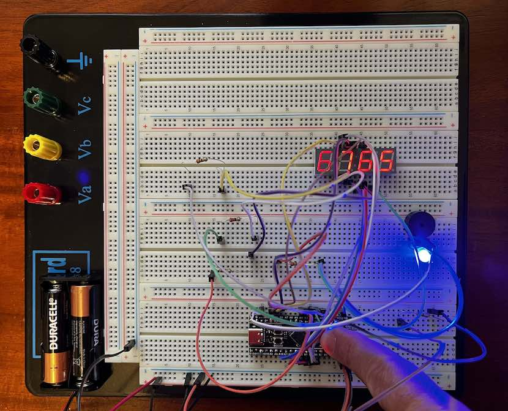

# STM32 - Black Pill - Fibonacci counter using 4-digit 7-segment display

This is an introductory project for education and portfolio purposes.

## Software/hardware setup

### Development:

- STM32CubeIDE
- ST-Link V2 programmer

### Project:

- WeAct Black Pill V2.0 board with STM32 chip
- 4-digit 7-segment display
- Piezo buzzer
- LED
- Built-in key/button on black pill

## Goals

- Drive the 4-digit 7-segment display, showing a Fibonacci count
- Use a button provided on the black pill board to increase the count to the next Fibonacci number (returning to zero on overflow of 4-digits)
- When button is pressed, piezo sounds and LED shows
- Use FreeRTOS
- Use two threads/tasks in FreeRTOS
	- the default task to drive the display
	- a secondary task to read keypresses/debounce etc

## Alternatives discussion

Instead of using two tasks in FreeRTOS, we could use an interrupt to deal with the keypress. That is not our goal in this project.

## 4-digit 7-segment display

Multi-digit 7-segment displays work by very quickly and continuously cycling through each digit, writing the particular digit and moving onto the next one, tricking our eyes into seeing the whole number as continuously showing.

## Code location

STM32CubeIDE uses comments in code to separate user code from code that it automatically generates.

Your code must be between `/* USER CODE BEGIN ... */` and `/* USER CODE END ... */` sections.

## Demo

